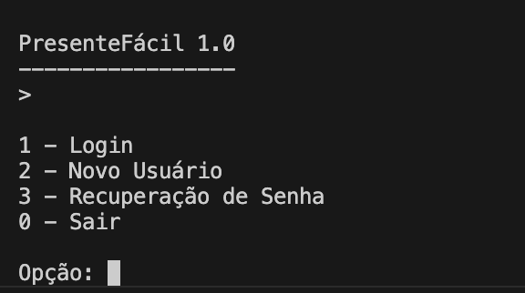
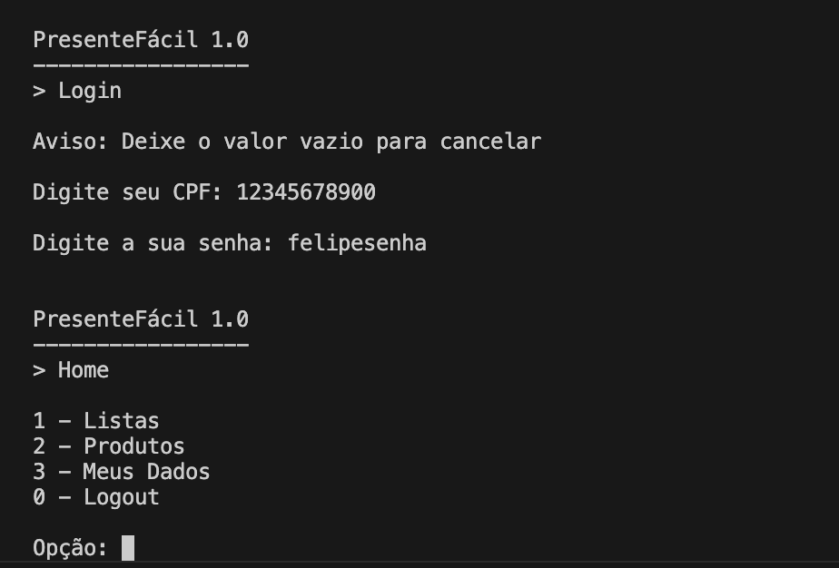
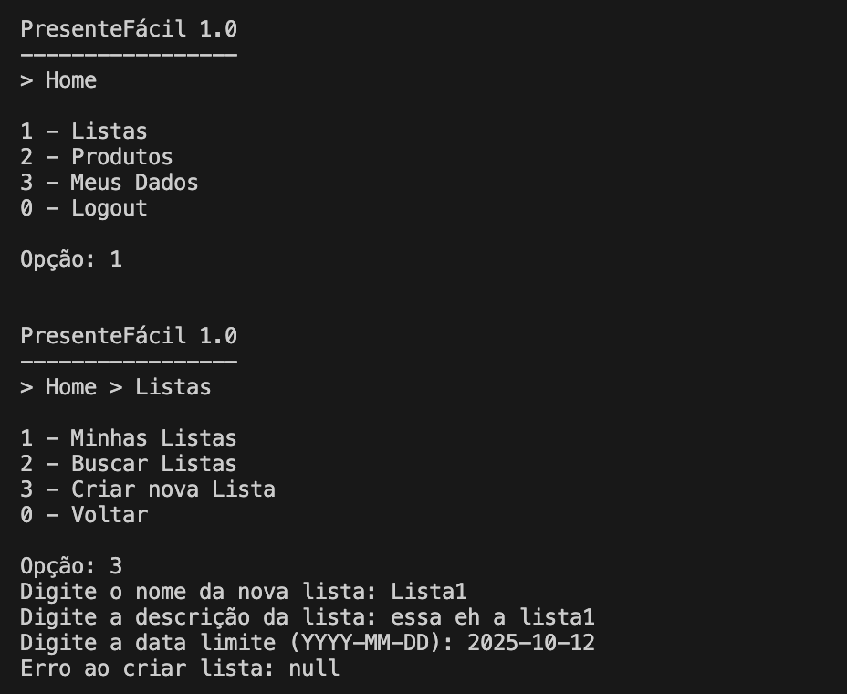

# Relatório do Trabalho Prático

## Participantes
- Davi Manoel
- Felipe Costa
- Felipe Quites
- Nayron Campos

---

## Descrição do Sistema
O sistema implementado tem como objetivo gerenciar listas de presentes dos usuários, permitindo que cada usuário crie, edite e visualize suas listas, além de acessar listas de outros usuários por meio de um código.  

Funcionalidades principais feitas:  
- CRUD de usuários
- Menu funcional
- Grande parte da classe lista feita
- Hash Extensível implementada
- Arvore B+ implementada

---

## Capturas de Tela
A seguir estão algumas telas do sistema para facilitar a correção:

### Tela Inicial

### Cadastro de Usuário

### Visualização do Login

### Visualização do Meus Dados

### Visualização do Cadastro das Listas

### Visualização do Código das Listas

---

## Estrutura de Classes
O sistema foi desenvolvido utilizando uma arquitetura orientada a objetos.  
As principais classes são:  

- Usuario — Representa os usuários cadastrados.
- Lista — Gerencia as listas vinculadas aos usuários.
- ArquivoUsuario — Gerencia o armazenamento e operações CRUD de usuários.
- ArquivoLista — Gerencia o armazenamento e operações CRUD de listas.
- ParCPFID / ParCodigoID — Realizam o mapeamento entre chaves e identificadores.
- aed3/HashExtensivel — Implementa a tabela hash extensível para índices diretos.
- aed3/ArvoreBMais — Implementa a Árvore B+ para índices indiretos e relacionamento 1:N.
- aed3/Arquivo — Classe base para operações de persistência em disco.

---

## Operações Especiais
O sistema contém as seguintes operações especiais:  

1. Tabela Hash Extensível para acesso direto a registros de usuários e listas.
2. Árvore B+ para gerenciamento do relacionamento entre usuários e listas.
3. Persistência em disco utilizando arquivos binários para garantir integridade dos dados.
4. Compartilhamento de listas por meio de códigos únicos.

---

## Checklist Obrigatório

- [x] Há um CRUD de usuários (que estende a classe `ArquivoIndexado`, acrescentando Tabelas Hash Extensíveis e Árvores B+ como índices diretos e indiretos conforme necessidade) que funciona corretamente?  
  **Resposta:** Sim. Todas as operações de CRUD para usuários foram implementadas e testadas com sucesso.  

- [] Há um CRUD de listas (que estende a classe `ArquivoIndexado`, acrescentando Tabelas Hash Extensíveis e Árvores B+ como índices diretos e indiretos conforme necessidade) que funciona corretamente?  
  **Resposta:** Não, infelizmente nós não conseguimos armazenar os dados das listas no arquivo, porém conseguimos criar a classe lista e a árvore B+, porém só conseguimos testar que ela estava funcionando com atribuição estática

- [x] As listas de presentes estão vinculadas aos usuários usando o `idUsuario` como chave estrangeira?  
  **Resposta:** Sim. Cada lista contém o campo `idUsuario`, garantindo o vínculo correto, porém como disse não está sendo registrada no arquivo 

- [x] Há uma árvore B+ que registre o relacionamento 1:N entre usuários e listas?  
  **Resposta:** Sim. A árvore B+ foi implementada para indexar múltiplas listas para um único usuário.  

- [x] Há um CRUD de usuários (que estende a classe `ArquivoIndexado`, acrescentando Tabelas Hash Extensíveis e Árvores B+ como índices diretos e indiretos conforme necessidade)?  
  **Resposta:** Sim. Essa funcionalidade já foi respondida na primeira questão, confirmando a implementação.  

- [] Há uma visualização das listas de outras pessoas por meio de um código NanoID?  
  **Resposta:** Não. O sistema gera um código NanoID único para cada lista, porém não é possível visualizar devido a ele não ser registrado no arquivo  

- [x] O trabalho compila corretamente?  
  **Resposta:** Sim. O sistema foi testado e compilado sem erros.
  Tiveram alguns problemas de dependência parece, mas com algumas modificações eles desaparecem, não sabemos o motivo

- [] O trabalho está completo e funcionando sem erros de execução?  
  **Resposta:** Não está completo, como eu disse não cadastra no arquivo as listas

- [x] O trabalho é original e não a cópia de um trabalho de outro grupo?  
  **Resposta:** Sim. O código foi desenvolvido pelo nosso grupo, a não ser os códigos genéricos passados pelo professor

---

### Dificuldades
- Implementação inicial da Árvore B+ devido à complexidade da estrutura.  
- Registro das listas no arquvio

