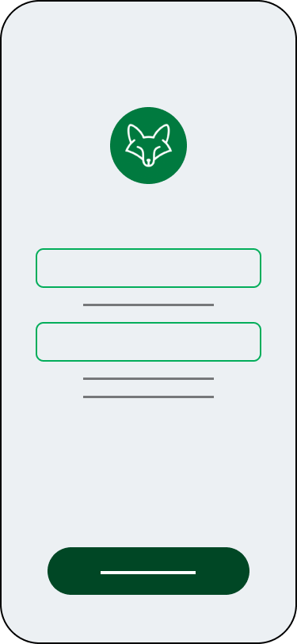

# Guará

### **Ideia inicial:** 
Um app de alerta para pessoas que se encontram em situação de perigo ou risco.
Você monta a sua rede de contatos de emergência e quando se encontrar em situação de risco você ativa um botão que grava o áudio dos seus arredores, aciona os seus contatos de emergência alertando que você está em situação de risco. Através da transcrição de áudio, uma IA interpreta e a partir disso pode enviar mensagens para seus contatos e talvez contatar a polícia local alertando a situação. 

### **Principais Funcionalidades:**
- Uso de IA na detecção do perigo através da transcrição do áudio do aparelho
- Contata automaticamente a rede de contatos de emergência selecionada
- Envio de localização para polícia e abertura de um chamado

OBS: Uma ideia inicial do app a ser desenvolvido. Pode sofrer alterações e mudança durante prototipação e construção

### **Público-Alvo:**
Pessoas que querem se sentir seguras durante o seu dia-a-dia e pessoas que querem garantir a segurança de seus amigos/família

### **ODSs Relacionadas:**
- ODS 3 - Saúde e Bem-Estar: Está ligado à segurança física no que tange à prevenção de acidentes, violência (como a de gênero) e promoção da segurança no trabalho.
- ODS 11 - Cidades e Comunidades Sustentáveis: Foca na segurança física no ambiente urbano, buscando tornar as cidades seguras, resilientes e inclusivas. Isso envolve espaços públicos seguros, transporte seguro e redução do impacto de desastres.
- ODS 16 - Paz, Justiça e Instituições Eficazes: Visa promover sociedades pacíficas, reduzir todas as formas de violência (incluindo abuso e tráfico), combater a criminalidade e garantir o estado de direito.

## **Alunos integrantes da equipe:**
* Daniel Matos Marques
* Davi Manoel Bernardes
* Felipe Costa Unsonst
* Felipe Quites Lopes
* Nayron Campos Soares
* Victor Monteiro Martinelli Grataroli

## **Professores responsáveis:**
* Cristiano Neves Rodrigues
* Ilo Amy Saldanha Rivero
* Pedro Henrique Ramos Costa
* Rosilane Ribeiro da Mota

## **Rascunho das Telas:**

1. Tela de Login
1. Tela Principal (Home)
1. Tela de Gravação
1. Tela de Contatos de Emergência
1. Tela de Alteração de Contatos

|  |  |  |  |  |
| :--: | :--: | :--: | :--: | :--: |
||  | | |  |
